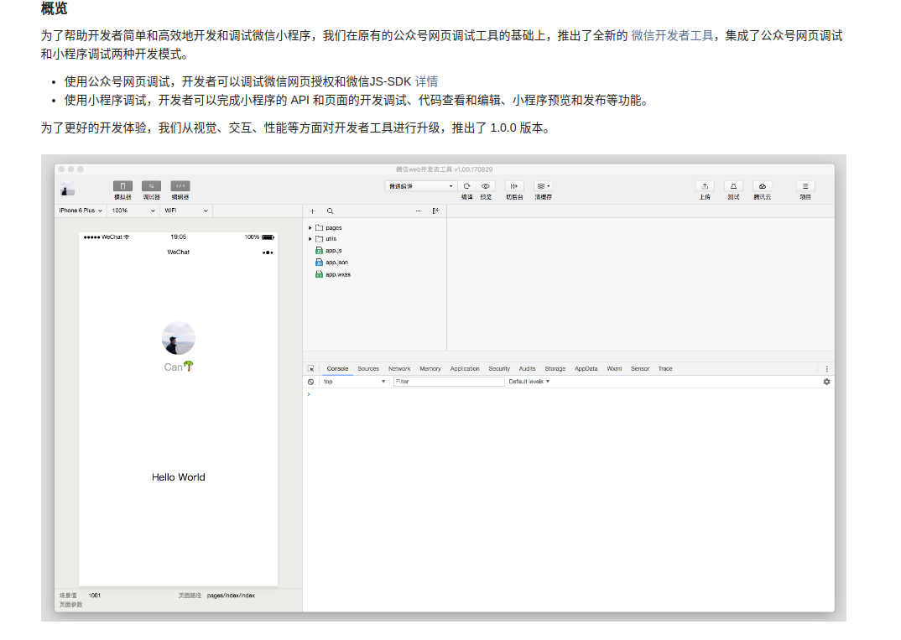
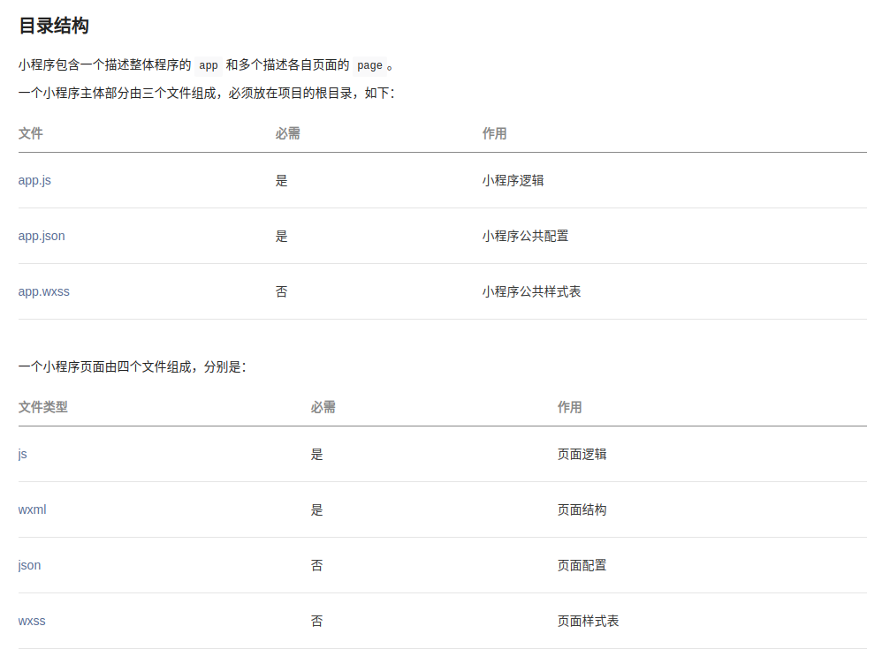
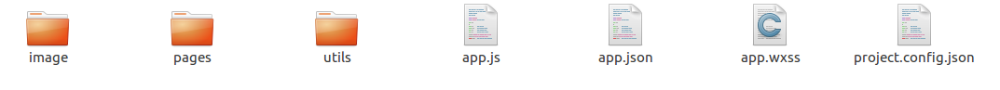

# Keras

## 介绍

**Keras: 基于 Python 的深度学习库**

Keras 是一个用 Python 编写的高级神经网络 API，它能够以 [TensorFlow](https://github.com/tensorflow/tensorflow), [CNTK](https://github.com/Microsoft/cntk) 或者 [Theano](https://github.com/Theano/Theano) 作为后端运行。Keras 的开发重点是支持快速的实验。*能够以最小的时延把你的想法转换为实验结果，是做好研究的关键。*

如果你在以下情况下需要深度学习库，请使用 Keras:

- 允许简单而快速的原型设计（由于用户友好，高度模块化，可扩展性）。
- 同时支持卷积神经网络和循环神经网络，以及两者的组合。
- 在 CPU 和 GPU 上无缝运行。

查看文档，请访问 [Keras.io](https://keras.io/zh/)。备份网址：[Keras-zh](https://keras-zh.readthedocs.io/)。

Keras 兼容的 Python 版本: __Python 2.7-3.6__。


**为什么取名为 Keras?**

Keras (κέρας) 在希腊语中意为 *号角* 。它来自古希腊和拉丁文学中的一个文学形象，首先出现于 *《奥德赛》* 中， 梦神 (_Oneiroi_, singular _Oneiros_) 从这两类人中分离出来：那些用虚幻的景象欺骗人类，通过象牙之门抵达地球之人，以及那些宣告未来即将到来，通过号角之门抵达之人。 它类似于文字寓意，κέρας (号角) / κραίνω (履行)，以及 ἐλέφας (象牙) / ἐλεφαίρομαι (欺骗)。

Keras 最初是作为 ONEIROS 项目（开放式神经电子智能机器人操作系统）研究工作的一部分而开发的。

> _"Oneiroi 超出了我们的理解 - 谁能确定它们讲述了什么故事？并不是所有人都能找到。那里有两扇门，就是通往短暂的 Oneiroi 的通道；一个是用号角制造的，一个是用象牙制造的。穿过尖锐的象牙的 Oneiroi 是诡计多端的，他们带有一些不会实现的信息； 那些穿过抛光的喇叭出来的人背后具有真理，对于看到他们的人来说是完成的。"_ Homer, Odyssey 19. 562 ff (Shewring translation).

------

**多后端 Keras 和 tf.keras:**

**目前，我们推荐使用 TensorFlow 后端的 Keras 用户切换至 TensorFlow 2.0 的 `tf.keras`。**
`tf.keras` 具有更好的维护，并且更好地集成了 TensorFlow 功能（eager执行，分布式支持及其他）。

Keras 2.2.5 是最后一个实现 2.2.* API 的 Keras 版本。它是最后一个仅支持 TensorFlow 1（以及 Theano 和 CNTK）的版本。

Keras 的当前版本是 2.3.0，它对 API 做了重大的调整，并且添加了 TensorFlow 2.0 的支持。2.3.0 将会是最后一个多后端 Keras 主版本。多后端 Keras 已被 `tf.keras` 取代。

多后端 Keras 中存在的错误修复仅会持续到 2020 年 4 月（作为次要版本的一部分）。

关于 Keras 未来的更多信息，详见 [the Keras meeting notes](http://bit.ly/keras-meeting-notes)。

### 

- __用户友好。__ Keras 是为人类而不是为机器设计的 API。它把用户体验放在首要和中心位置。Keras 遵循减少认知困难的最佳实践：它提供一致且简单的 API，将常见用例所需的用户操作数量降至最低，并且在用户错误时提供清晰和可操作的反馈。
- __模块化。__ 模型被理解为由独立的、完全可配置的模块构成的序列或图。这些模块可以以尽可能少的限制组装在一起。特别是神经网络层、损失函数、优化器、初始化方法、激活函数、正则化方法，它们都是可以结合起来构建新模型的模块。
- __易扩展性。__ 新的模块是很容易添加的（作为新的类和函数），现有的模块已经提供了充足的示例。由于能够轻松地创建可以提高表现力的新模块，Keras 更加适合高级研究。
- __基于 Python 实现。__ Keras 没有特定格式的单独配置文件。模型定义在 Python 代码中，这些代码紧凑，易于调试，并且易于扩展。

------

## 快速开始：30 秒上手 Keras

Keras 的核心数据结构是 __model__，一种组织网络层的方式。最简单的模型是 [Sequential 顺序模型](/getting-started/sequential-model-guide)，它由多个网络层线性堆叠。对于更复杂的结构，你应该使用 [Keras 函数式 API](/getting-started/functional-api-guide)，它允许构建任意的神经网络图。

`Sequential` 模型如下所示：

```python
from keras.models import Sequential

model = Sequential()
```

可以简单地使用 `.add()` 来堆叠模型：

```python
from keras.layers import Dense

model.add(Dense(units=64, activation='relu', input_dim=100))
model.add(Dense(units=10, activation='softmax'))
```

在完成了模型的构建后, 可以使用 `.compile()` 来配置学习过程：

```python
model.compile(loss='categorical_crossentropy',
              optimizer='sgd',
              metrics=['accuracy'])
```

如果需要，你还可以进一步地配置你的优化器。Keras 的核心原则是使事情变得相当简单，同时又允许用户在需要的时候能够进行完全的控制（终极的控制是源代码的易扩展性）。

```python
model.compile(loss=keras.losses.categorical_crossentropy,
              optimizer=keras.optimizers.SGD(lr=0.01, momentum=0.9, nesterov=True))
```

现在，你可以批量地在训练数据上进行迭代了：

```python
# x_train 和 y_train 是 Numpy 数组 -- 就像在 Scikit-Learn API 中一样。
model.fit(x_train, y_train, epochs=5, batch_size=32)
```

或者，你可以手动地将批次的数据提供给模型：

```python
model.train_on_batch(x_batch, y_batch)
```

只需一行代码就能评估模型性能：

```python
loss_and_metrics = model.evaluate(x_test, y_test, batch_size=128)
```

或者对新的数据生成预测：

```python
classes = model.predict(x_test, batch_size=128)
```

------

## 安装指引

在安装 Keras 之前，请安装以下后端引擎之一: TensorFlow, Theano 或者 CNTK。我们推荐 TensorFlow 后端。

- [TensorFlow 安装指引](https://www.tensorflow.org/install/)。
- [Theano 安装指引](http://deeplearning.net/software/theano/install.html#install)。
- [CNTK 安装指引](https://docs.microsoft.com/en-us/cognitive-toolkit/setup-cntk-on-your-machine)。

你也可以考虑安装以下**可选依赖**：

- [cuDNN](https://docs.nvidia.com/deeplearning/sdk/cudnn-install/) (如果你计划在 GPU 上运行 Keras，建议安装)。
- HDF5 和 [h5py](http://docs.h5py.org/en/latest/build.html) (如果你需要将 Keras 模型保存到磁盘，则需要这些)。
- [graphviz](https://graphviz.gitlab.io/download/) 和 [pydot](https://github.com/erocarrera/pydot) (用于绘制模型图的[可视化工具](https://keras.io/zh/visualization/))。

然后你就可以安装 Keras 本身了。有两种方法安装 Keras：

- **使用 PyPI 安装 Keras（推荐）：**

注意：这些安装步骤假定你在 Linux 或 Mac 环境中。
如果你使用的是 Windows，则需要删除 `sudo` 才能运行以下命令。

```sh
sudo pip install keras
```

如果你使用 virtualenv 虚拟环境, 你可以避免使用 sudo：

```sh
pip install keras
```

- **或者：使用 GitHub 源码安装 Keras：**

首先，使用 `git` 来克隆 Keras：

```sh
git clone https://github.com/keras-team/keras.git
```

然后，`cd` 到 Keras 目录并且运行安装命令：

```sh
cd keras
sudo python setup.py install
```

------

## 为什么选择 Keras？

在如今无数深度学习框架中，为什么要使用 Keras 而非其他？以下是 Keras 与现有替代品的一些比较。

------

#### Keras 优先考虑开发人员的经验

- Keras 是为人类而非机器设计的 API。[Keras 遵循减少认知困难的最佳实践](https://blog.keras.io/user-experience-design-for-apis.html): 它提供一致且简单的 API，它将常见用例所需的用户操作数量降至最低，并且在用户错误时提供清晰和可操作的反馈。
- 这使 Keras 易于学习和使用。作为 Keras 用户，你的工作效率更高，能够比竞争对手更快地尝试更多创意，从而[帮助你赢得机器学习竞赛](https://www.quora.com/Why-has-Keras-been-so-successful-lately-at-Kaggle-competitions)。
- 这种易用性并不以降低灵活性为代价：因为 Keras 与底层深度学习语言（特别是 TensorFlow）集成在一起，所以它可以让你实现任何你可以用基础语言编写的东西。特别是，`tf.keras` 作为 Keras API 可以与 TensorFlow 工作流无缝集成。

------

#### Keras 被工业界和学术界广泛采用


<p style='font-style: italic; font-size: 10pt; text-align: center;'>
    Deep learning 框架排名，由 Jeff Hale 基于 7 个分类的 11 个数据源计算得出
</i>
</p>

截至 2018 年中期，Keras 拥有超过 250,000 名个人用户。与其他任何深度学习框架相比，Keras 在行业和研究领域的应用率更高（除 TensorFlow 之外，且 Keras API 是 TensorFlow 的官方前端，通过 `tf.keras` 模块使用）。

你已经不断与使用 Keras 构建的功能进行交互 - 它在 Netflix, Uber, Yelp, Instacart, Zocdoc, Square 等众多网站上被使用。它尤其受以深度学习作为产品核心的创业公司的欢迎。

Keras 也是深度学习研究人员的最爱，在上传到预印本服务器 [arXiv.org](https://arxiv.org/archive/cs) 的科学论文中被提及的次数位居第二。Keras 还被大型科学组织的研究人员采用，特别是 CERN 和 NASA。

------

#### Keras 可以轻松将模型转化为产品

与任何其他深度学习框架相比，你的 Keras 模型可以轻松地部署在更广泛的平台上：

- 在 iOS 上，通过 [Apple’s CoreML](https://developer.apple.com/documentation/coreml)（苹果为 Keras 提供官方支持）。这里有一个[教程](https://www.pyimagesearch.com/2018/04/23/running-keras-models-on-ios-with-coreml/)。
- 在 Android 上，通过 TensorFlow Android runtime。例如 [Not Hotdog app](https://medium.com/@timanglade/how-hbos-silicon-valley-built-not-hotdog-with-mobile-tensorflow-keras-react-native-ef03260747f3)。
- 在浏览器中，通过 GPU 加速的 JavaScript 运行时，例如 [Keras.js](https://transcranial.github.io/keras-js/#/) 和 [WebDNN](https://mil-tokyo.github.io/webdnn/)。
- 在 Google Cloud 上，通过 [TensorFlow-Serving](https://www.tensorflow.org/serving/)。
- [在 Python webapp 后端中（比如 Flask app）](https://blog.keras.io/building-a-simple-keras-deep-learning-rest-api.html)。
- 在 JVM 上，通过 [SkyMind 提供的 DL4J 模型导入](https://deeplearning4j.org/model-import-keras)。
- 在 Raspberry Pi 树莓派上。

------

#### Keras 支持多个后端引擎，不会将你锁定到一个生态系统中

你的 Keras 模型可以基于不同的[深度学习后端](https://keras.io/zh/backend/)开发。重要的是，任何仅利用内置层构建的 Keras 模型，都可以在所有这些后端中移植：你可以用一种后端训练模型，再将它载入另一种后端中（例如为了发布的需要）。支持的后端有：

- 谷歌的 TensorFlow 后端
- 微软的 CNTK 后端
- Theano 后端

亚马逊也有一个[使用 MXNet 作为后端的 Keras 分支](https://github.com/awslabs/keras-apache-mxnet)。

如此一来，你的 Keras 模型可以在 CPU 之外的不同硬件平台上训练：

- [NVIDIA GPUs](https://developer.nvidia.com/deep-learning)
- [Google TPUs](https://cloud.google.com/tpu/)，通过 TensorFlow 后端和 Google Cloud
- OpenCL 支持的 GPUs，比如 AMD, 通过 [PlaidML Keras 后端](https://github.com/plaidml/plaidml)

------

#### Keras 拥有强大的多 GPU 和分布式训练支持

- Keras [内置对多 GPU 数据并行的支持](https://keras.io/zh/utils/#multi_gpu_model)。
- 优步的 [Horovod](https://github.com/uber/horovod) 对 Keras 模型拥有一流的支持。
- Keras 模型[可以被转换为 TensorFlow Estimators](https://www.tensorflow.org/versions/master/api_docs/python/tf/keras/estimator/model_to_estimator) 并在 [Google Cloud 的 GPU 集群](https://cloud.google.com/solutions/running-distributed-tensorflow-on-compute-engine)上训练。
- Keras 可以在 Spark（通过 CERN 的 [Dist-Keras](https://github.com/cerndb/dist-keras)）和 [Elephas](https://github.com/maxpumperla/elephas) 上运行。

------

#### Keras 的发展得到深度学习生态系统中的关键公司的支持

Keras 的开发主要由谷歌支持，Keras API 以 `tf.keras` 的形式包装在 TensorFlow 中。此外，微软维护着 Keras 的 CNTK 后端。亚马逊 AWS 正在开发 MXNet 支持。其他提供支持的公司包括 NVIDIA、优步、苹果（通过 CoreML）等。


## 开始使用 Keras Sequential 顺序模型

顺序模型是多个网络层的线性堆叠。

你可以通过将网络层实例的列表传递给 `Sequential` 的构造器，来创建一个 `Sequential` 模型：

```python
from keras.models import Sequential
from keras.layers import Dense, Activation

model = Sequential([
    Dense(32, input_shape=(784,)),
    Activation('relu'),
    Dense(10),
    Activation('softmax'),
])
```

也可以简单地使用 `.add()` 方法将各层添加到模型中：

```python
model = Sequential()
model.add(Dense(32, input_dim=784))
model.add(Activation('relu'))
```

------

### 指定输入数据的尺寸

模型需要知道它所期望的输入的尺寸。出于这个原因，顺序模型中的第一层（且只有第一层，因为下面的层可以自动地推断尺寸）需要接收关于其输入尺寸的信息。有几种方法来做到这一点：

- 传递一个 `input_shape` 参数给第一层。它是一个表示尺寸的元组 (一个由整数或 `None` 组成的元组，其中 `None` 表示可能为任何正整数)。在 `input_shape` 中不包含数据的 batch 大小。
- 某些 2D 层，例如 `Dense`，支持通过参数 `input_dim` 指定输入尺寸，某些 3D 时序层支持 `input_dim` 和 `input_length` 参数。
- 如果你需要为你的输入指定一个固定的 batch 大小（这对 stateful RNNs 很有用），你可以传递一个 `batch_size` 参数给一个层。如果你同时将 `batch_size=32` 和 `input_shape=(6, 8)` 传递给一个层，那么每一批输入的尺寸就为 `(32，6，8)`。

因此，下面的代码片段是等价的：

```python
model = Sequential()
model.add(Dense(32, input_shape=(784,)))
```

```python
model = Sequential()
model.add(Dense(32, input_dim=784))
```

------

#### 模型编译

在训练模型之前，您需要配置学习过程，这是通过 `compile` 方法完成的。它接收三个参数：

- 优化器 optimizer。它可以是现有优化器的字符串标识符，如 `rmsprop` 或 `adagrad`，也可以是 Optimizer 类的实例。详见：[optimizers](/optimizers)。
- 损失函数 loss，模型试图最小化的目标函数。它可以是现有损失函数的字符串标识符，如 `categorical_crossentropy` 或 `mse`，也可以是一个目标函数。详见：[losses](/losses)。
- 评估标准 metrics。对于任何分类问题，你都希望将其设置为 `metrics = ['accuracy']`。评估标准可以是现有的标准的字符串标识符，也可以是自定义的评估标准函数。详见: [metrics](/metrics)。

```python
# 多分类问题
model.compile(optimizer='rmsprop',
              loss='categorical_crossentropy',
              metrics=['accuracy'])

# 二分类问题
model.compile(optimizer='rmsprop',
              loss='binary_crossentropy',
              metrics=['accuracy'])

# 均方误差回归问题
model.compile(optimizer='rmsprop',
              loss='mse')

# 自定义评估标准函数
import keras.backend as K

def mean_pred(y_true, y_pred):
    return K.mean(y_pred)

model.compile(optimizer='rmsprop',
              loss='binary_crossentropy',
              metrics=['accuracy', mean_pred])
```

------

#### 模型训练

Keras 模型在输入数据和标签的 Numpy 矩阵上进行训练。为了训练一个模型，你通常会使用 `fit` 函数。[文档详见此处](/models/sequential)。

```python
# 对于具有 2 个类的单输入模型（二进制分类）：

model = Sequential()
model.add(Dense(32, activation='relu', input_dim=100))
model.add(Dense(1, activation='sigmoid'))
model.compile(optimizer='rmsprop',
              loss='binary_crossentropy',
              metrics=['accuracy'])

# 生成虚拟数据
import numpy as np
data = np.random.random((1000, 100))
labels = np.random.randint(2, size=(1000, 1))

# 训练模型，以 32 个样本为一个 batch 进行迭代
model.fit(data, labels, epochs=10, batch_size=32)
```

```python
# 对于具有 10 个类的单输入模型（多分类分类）：

model = Sequential()
model.add(Dense(32, activation='relu', input_dim=100))
model.add(Dense(10, activation='softmax'))
model.compile(optimizer='rmsprop',
              loss='categorical_crossentropy',
              metrics=['accuracy'])

# 生成虚拟数据
import numpy as np
data = np.random.random((1000, 100))
labels = np.random.randint(10, size=(1000, 1))

# 将标签转换为分类的 one-hot 编码
one_hot_labels = keras.utils.to_categorical(labels, num_classes=10)

# 训练模型，以 32 个样本为一个 batch 进行迭代
model.fit(data, one_hot_labels, epochs=10, batch_size=32)
```

### 基于多层感知器 (MLP) 的 softmax 多分类：

```python
import keras
from keras.models import Sequential
from keras.layers import Dense, Dropout, Activation
from keras.optimizers import SGD

# 生成虚拟数据
import numpy as np
x_train = np.random.random((1000, 20))
y_train = keras.utils.to_categorical(np.random.randint(10, size=(1000, 1)), num_classes=10)
x_test = np.random.random((100, 20))
y_test = keras.utils.to_categorical(np.random.randint(10, size=(100, 1)), num_classes=10)

model = Sequential()
# Dense(64) 是一个具有 64 个隐藏神经元的全连接层。
# 在第一层必须指定所期望的输入数据尺寸：
# 在这里，是一个 20 维的向量。
model.add(Dense(64, activation='relu', input_dim=20))
model.add(Dropout(0.5))
model.add(Dense(64, activation='relu'))
model.add(Dropout(0.5))
model.add(Dense(10, activation='softmax'))

sgd = SGD(lr=0.01, decay=1e-6, momentum=0.9, nesterov=True)
model.compile(loss='categorical_crossentropy',
              optimizer=sgd,
              metrics=['accuracy'])

model.fit(x_train, y_train,
          epochs=20,
          batch_size=128)
score = model.evaluate(x_test, y_test, batch_size=128)
```

### 基于多层感知器的二分类：

```python
import numpy as np
from keras.models import Sequential
from keras.layers import Dense, Dropout

# 生成虚拟数据
x_train = np.random.random((1000, 20))
y_train = np.random.randint(2, size=(1000, 1))
x_test = np.random.random((100, 20))
y_test = np.random.randint(2, size=(100, 1))

model = Sequential()
model.add(Dense(64, input_dim=20, activation='relu'))
model.add(Dropout(0.5))
model.add(Dense(64, activation='relu'))
model.add(Dropout(0.5))
model.add(Dense(1, activation='sigmoid'))

model.compile(loss='binary_crossentropy',
              optimizer='rmsprop',
              metrics=['accuracy'])

model.fit(x_train, y_train,
          epochs=20,
          batch_size=128)
score = model.evaluate(x_test, y_test, batch_size=128)
```

### 类似 VGG 的卷积神经网络：

```python
import numpy as np
import keras
from keras.models import Sequential
from keras.layers import Dense, Dropout, Flatten
from keras.layers import Conv2D, MaxPooling2D
from keras.optimizers import SGD

# 生成虚拟数据
x_train = np.random.random((100, 100, 100, 3))
y_train = keras.utils.to_categorical(np.random.randint(10, size=(100, 1)), num_classes=10)
x_test = np.random.random((20, 100, 100, 3))
y_test = keras.utils.to_categorical(np.random.randint(10, size=(20, 1)), num_classes=10)

model = Sequential()
# 输入: 3 通道 100x100 像素图像 -> (100, 100, 3) 张量。
# 使用 32 个大小为 3x3 的卷积滤波器。
model.add(Conv2D(32, (3, 3), activation='relu', input_shape=(100, 100, 3)))
model.add(Conv2D(32, (3, 3), activation='relu'))
model.add(MaxPooling2D(pool_size=(2, 2)))
model.add(Dropout(0.25))

model.add(Conv2D(64, (3, 3), activation='relu'))
model.add(Conv2D(64, (3, 3), activation='relu'))
model.add(MaxPooling2D(pool_size=(2, 2)))
model.add(Dropout(0.25))

model.add(Flatten())
model.add(Dense(256, activation='relu'))
model.add(Dropout(0.5))
model.add(Dense(10, activation='softmax'))

sgd = SGD(lr=0.01, decay=1e-6, momentum=0.9, nesterov=True)
model.compile(loss='categorical_crossentropy', optimizer=sgd)

model.fit(x_train, y_train, batch_size=32, epochs=10)
score = model.evaluate(x_test, y_test, batch_size=32)
```

### 基于 LSTM 的序列分类：

```python
from keras.models import Sequential
from keras.layers import Dense, Dropout
from keras.layers import Embedding
from keras.layers import LSTM

max_features = 1024

model = Sequential()
model.add(Embedding(max_features, output_dim=256))
model.add(LSTM(128))
model.add(Dropout(0.5))
model.add(Dense(1, activation='sigmoid'))

model.compile(loss='binary_crossentropy',
              optimizer='rmsprop',
              metrics=['accuracy'])

model.fit(x_train, y_train, batch_size=16, epochs=10)
score = model.evaluate(x_test, y_test, batch_size=16)
```

### 基于 1D 卷积的序列分类：

```python
from keras.models import Sequential
from keras.layers import Dense, Dropout
from keras.layers import Embedding
from keras.layers import Conv1D, GlobalAveragePooling1D, MaxPooling1D

seq_length = 64

model = Sequential()
model.add(Conv1D(64, 3, activation='relu', input_shape=(seq_length, 100)))
model.add(Conv1D(64, 3, activation='relu'))
model.add(MaxPooling1D(3))
model.add(Conv1D(128, 3, activation='relu'))
model.add(Conv1D(128, 3, activation='relu'))
model.add(GlobalAveragePooling1D())
model.add(Dropout(0.5))
model.add(Dense(1, activation='sigmoid'))

model.compile(loss='binary_crossentropy',
              optimizer='rmsprop',
              metrics=['accuracy'])

model.fit(x_train, y_train, batch_size=16, epochs=10)
score = model.evaluate(x_test, y_test, batch_size=16)
```

## 开始使用 Keras 函数式 API

Keras 函数式 API 是定义复杂模型（如多输出模型、有向无环图或具有共享层的模型）的方法。

这部分文档假设你已经对 `Sequential` 顺序模型比较熟悉。

让我们先从一些简单的示例开始。

------

### 例一：全连接网络

`Sequential` 模型可能是实现这种网络的一个更好选择，但这个例子能够帮助我们进行一些简单的理解。

- 网络层的实例是可调用的，它以张量为参数，并且返回一个张量
- 输入和输出均为张量，它们都可以用来定义一个模型（`Model`）
- 这样的模型同 Keras 的 `Sequential` 模型一样，都可以被训练

```python
from keras.layers import Input, Dense
from keras.models import Model

# 这部分返回一个张量
inputs = Input(shape=(784,))

# 层的实例是可调用的，它以张量为参数，并且返回一个张量
output_1 = Dense(64, activation='relu')(inputs)
output_2 = Dense(64, activation='relu')(output_1)
predictions = Dense(10, activation='softmax')(output_2)

# 这部分创建了一个包含输入层和三个全连接层的模型
model = Model(inputs=inputs, outputs=predictions)
model.compile(optimizer='rmsprop',
              loss='categorical_crossentropy',
              metrics=['accuracy'])
model.fit(data, labels)  # 开始训练
```

------

### 所有的模型都可调用，就像网络层一样

利用函数式 API，可以轻易地重用训练好的模型：可以将任何模型看作是一个层，然后通过传递一个张量来调用它。注意，在调用模型时，您不仅重用模型的*结构*，还重用了它的权重。

```python
x = Input(shape=(784,))
# 这是可行的，并且返回上面定义的 10-way softmax。
y = model(x)
```

这种方式能允许我们快速创建可以处理*序列输入*的模型。只需一行代码，你就将图像分类模型转换为视频分类模型。

```python
from keras.layers import TimeDistributed

# 输入张量是 20 个时间步的序列，
# 每一个时间为一个 784 维的向量
input_sequences = Input(shape=(20, 784))

# 这部分将我们之前定义的模型应用于输入序列中的每个时间步。
# 之前定义的模型的输出是一个 10-way softmax，
# 因而下面的层的输出将是维度为 10 的 20 个向量的序列。
processed_sequences = TimeDistributed(model)(input_sequences)
```

------

### 多输入多输出模型

以下是函数式 API 的一个很好的例子：具有多个输入和输出的模型。函数式 API 使处理大量交织的数据流变得容易。

来考虑下面的模型。我们试图预测 Twitter 上的一条新闻标题有多少转发和点赞数。模型的主要输入将是新闻标题本身，即一系列词语，但是为了增添趣味，我们的模型还添加了其他的辅助输入来接收额外的数据，例如新闻标题的发布的时间等。
该模型也将通过两个损失函数进行监督学习。较早地在模型中使用主损失函数，是深度学习模型的一个良好正则方法。

模型结构如下图所示：


让我们用函数式 API 来实现它。

主要输入接收新闻标题本身，即一个整数序列（每个整数编码一个词）。这些整数在 1 到 10,000 之间（10,000 个词的词汇表），且序列长度为 100 个词。

```python
from keras.layers import Input, Embedding, LSTM, Dense
from keras.models import Model
import numpy as np
np.random.seed(0)  # 设置随机种子，用于复现结果

# 标题输入：接收一个含有 100 个整数的序列，每个整数在 1 到 10000 之间。
# 注意我们可以通过传递一个 "name" 参数来命名任何层。
main_input = Input(shape=(100,), dtype='int32', name='main_input')

# Embedding 层将输入序列编码为一个稠密向量的序列，
# 每个向量维度为 512。
x = Embedding(output_dim=512, input_dim=10000, input_length=100)(main_input)

# LSTM 层把向量序列转换成单个向量，
# 它包含整个序列的上下文信息
lstm_out = LSTM(32)(x)
```

在这里，我们插入辅助损失，使得即使在模型主损失很高的情况下，LSTM 层和 Embedding 层都能被平稳地训练。

```python
auxiliary_output = Dense(1, activation='sigmoid', name='aux_output')(lstm_out)
```

此时，我们将辅助输入数据与 LSTM 层的输出连接起来，输入到模型中：

```python
auxiliary_input = Input(shape=(5,), name='aux_input')
x = keras.layers.concatenate([lstm_out, auxiliary_input])

# 堆叠多个全连接网络层
x = Dense(64, activation='relu')(x)
x = Dense(64, activation='relu')(x)
x = Dense(64, activation='relu')(x)

# 最后添加主要的逻辑回归层
main_output = Dense(1, activation='sigmoid', name='main_output')(x)
```

然后定义一个具有两个输入和两个输出的模型：

```python
model = Model(inputs=[main_input, auxiliary_input], outputs=[main_output, auxiliary_output])
```

现在编译模型，并给辅助损失分配一个 0.2 的权重。如果要为不同的输出指定不同的 `loss_weights` 或 `loss`，可以使用列表或字典。
在这里，我们给 `loss` 参数传递单个损失函数，这个损失将用于所有的输出。

```python
model.compile(optimizer='rmsprop', loss='binary_crossentropy',
              loss_weights=[1., 0.2])
```

我们可以通过传递输入数组和目标数组的列表来训练模型：

```python
headline_data = np.round(np.abs(np.random.rand(12, 100) * 100))
additional_data = np.random.randn(12, 5)
headline_labels = np.random.randn(12, 1)
additional_labels = np.random.randn(12, 1)
model.fit([headline_data, additional_data], [headline_labels, additional_labels],
          epochs=50, batch_size=32)
```

由于输入和输出均被命名了（在定义时传递了一个 `name` 参数），我们也可以通过以下方式编译模型：

```python
model.compile(optimizer='rmsprop',
              loss={'main_output': 'binary_crossentropy', 'aux_output': 'binary_crossentropy'},
              loss_weights={'main_output': 1., 'aux_output': 0.2})

# 然后使用以下方式训练：
model.fit({'main_input': headline_data, 'aux_input': additional_data},
          {'main_output': headline_labels, 'aux_output': additional_labels},
          epochs=50, batch_size=32)
```

若使用此模型做推理，可以

```python
model.predict({'main_input': headline_data, 'aux_input': additional_data})
```

或者

```python
pred = model.predict([headline_data, additional_data])
```

------

### 共享网络层

函数式 API 的另一个用途是使用共享网络层的模型。我们来看看共享层。

来考虑推特推文数据集。我们想要建立一个模型来分辨两条推文是否来自同一个人（例如，通过推文的相似性来对用户进行比较）。

实现这个目标的一种方法是建立一个模型，将两条推文编码成两个向量，连接向量，然后添加逻辑回归层；这将输出两条推文来自同一作者的概率。模型将接收一对对正负表示的推特数据。

由于这个问题是对称的，编码第一条推文的机制应该被完全重用来编码第二条推文（权重及其他全部）。这里我们使用一个共享的 LSTM 层来编码推文。

让我们使用函数式 API 来构建它。首先我们将一条推特转换为一个尺寸为 `(280, 256)` 的矩阵，即每条推特 280 字符，每个字符为 256 维的 one-hot 编码向量 （取 256 个常用字符）。

```python
import keras
from keras.layers import Input, LSTM, Dense
from keras.models import Model

tweet_a = Input(shape=(280, 256))
tweet_b = Input(shape=(280, 256))
```

要在不同的输入上共享同一个层，只需实例化该层一次，然后根据需要传入你想要的输入即可：

```python
# 这一层可以输入一个矩阵，并返回一个 64 维的向量
shared_lstm = LSTM(64)

# 当我们重用相同的图层实例多次，图层的权重也会被重用 (它其实就是同一层)
encoded_a = shared_lstm(tweet_a)
encoded_b = shared_lstm(tweet_b)

# 然后再连接两个向量：
merged_vector = keras.layers.concatenate([encoded_a, encoded_b], axis=-1)

# 再在上面添加一个逻辑回归层
predictions = Dense(1, activation='sigmoid')(merged_vector)

# 定义一个连接推特输入和预测的可训练的模型
model = Model(inputs=[tweet_a, tweet_b], outputs=predictions)

model.compile(optimizer='rmsprop',
              loss='binary_crossentropy',
              metrics=['accuracy'])
model.fit([data_a, data_b], labels, epochs=10)
```

让我们暂停一会，看看如何读取共享层的输出或输出尺寸。

------

### 层「节点」的概念

每当你在某个输入上调用一个层时，都将创建一个新的张量（层的输出），并且为该层添加一个「节点」，将输入张量连接到输出张量。当多次调用同一个图层时，该图层将拥有多个节点索引 (0, 1, 2...)。

在之前版本的 Keras 中，可以通过 `layer.get_output()` 来获得层实例的输出张量，或者通过 `layer.output_shape` 来获取其输出形状。现在你依然可以这么做（除了 `get_output()` 已经被 `output` 属性替代）。但是如果一个层与多个输入连接呢？

只要一个层仅仅连接到一个输入，就不会有困惑，`.output` 会返回层的唯一输出：

```python
a = Input(shape=(280, 256))

lstm = LSTM(32)
encoded_a = lstm(a)

assert lstm.output == encoded_a
```

但是如果该层有多个输入，那就会出现问题：

```python
a = Input(shape=(280, 256))
b = Input(shape=(280, 256))

lstm = LSTM(32)
encoded_a = lstm(a)
encoded_b = lstm(b)

lstm.output
```

```
>> AttributeError: Layer lstm_1 has multiple inbound nodes,
hence the notion of "layer output" is ill-defined.
Use `get_output_at(node_index)` instead.
```

好吧，通过下面的方法可以解决：

```python
assert lstm.get_output_at(0) == encoded_a
assert lstm.get_output_at(1) == encoded_b
```

够简单，对吧？

`input_shape` 和 `output_shape` 这两个属性也是如此：只要该层只有一个节点，或者只要所有节点具有相同的输入/输出尺寸，那么「层输出/输入尺寸」的概念就被很好地定义，且将由 `layer.output_shape` / `layer.input_shape` 返回。但是比如说，如果将一个 `Conv2D` 层先应用于尺寸为 `(32，32，3)` 的输入，再应用于尺寸为 `(64, 64, 3)` 的输入，那么这个层就会有多个输入/输出尺寸，你将不得不通过指定它们所属节点的索引来获取它们：

```python
a = Input(shape=(32, 32, 3))
b = Input(shape=(64, 64, 3))

conv = Conv2D(16, (3, 3), padding='same')
conved_a = conv(a)

# 到目前为止只有一个输入，以下可行：
assert conv.input_shape == (None, 32, 32, 3)

conved_b = conv(b)
# 现在 `.input_shape` 属性不可行，但是这样可以：
assert conv.get_input_shape_at(0) == (None, 32, 32, 3)
assert conv.get_input_shape_at(1) == (None, 64, 64, 3)
```

------

### 更多的例子

#### Inception 模型

有关 Inception 结构的更多信息，请参阅 [Going Deeper with Convolutions](http://arxiv.org/abs/1409.4842)。

```python
from keras.layers import Conv2D, MaxPooling2D, Input

input_img = Input(shape=(256, 256, 3))

tower_1 = Conv2D(64, (1, 1), padding='same', activation='relu')(input_img)
tower_1 = Conv2D(64, (3, 3), padding='same', activation='relu')(tower_1)

tower_2 = Conv2D(64, (1, 1), padding='same', activation='relu')(input_img)
tower_2 = Conv2D(64, (5, 5), padding='same', activation='relu')(tower_2)

tower_3 = MaxPooling2D((3, 3), strides=(1, 1), padding='same')(input_img)
tower_3 = Conv2D(64, (1, 1), padding='same', activation='relu')(tower_3)

output = keras.layers.concatenate([tower_1, tower_2, tower_3], axis=1)
```

#### 卷积层上的残差连接

有关残差网络 (Residual Network) 的更多信息，请参阅 [Deep Residual Learning for Image Recognition](http://arxiv.org/abs/1512.03385)。

```python
from keras.layers import Conv2D, Input

# 输入张量为 3 通道 256x256 图像
x = Input(shape=(256, 256, 3))
# 3 输出通道（与输入通道相同）的 3x3 卷积核
y = Conv2D(3, (3, 3), padding='same')(x)
# 返回 x + y
z = keras.layers.add([x, y])
```

## 编写你自己的 Keras 层

对于简单、无状态的自定义操作，你也许可以通过 `layers.core.Lambda` 层来实现。但是对于那些包含了可训练权重的自定义层，你应该自己实现这种层。

这是一个 **Keras 2.0** 中，Keras 层的骨架（如果你用的是旧的版本，请更新到新版）。你只需要实现三个方法即可:

- `build(input_shape)`: 这是你定义权重的地方。这个方法必须设 `self.built = True`，可以通过调用 `super([Layer], self).build()` 完成。
- `call(x)`: 这里是编写层的功能逻辑的地方。你只需要关注传入 `call` 的第一个参数：输入张量，除非你希望你的层支持masking。
- `compute_output_shape(input_shape)`: 如果你的层更改了输入张量的形状，你应该在这里定义形状变化的逻辑，这让Keras能够自动推断各层的形状。

```python
from keras import backend as K
from keras.engine.topology import Layer

class MyLayer(Layer):

    def __init__(self, output_dim, **kwargs):
        self.output_dim = output_dim
        super(MyLayer, self).__init__(**kwargs)

    def build(self, input_shape):
        # 为该层创建一个可训练的权重
        self.kernel = self.add_weight(name='kernel', 
                                      shape=(input_shape[1], self.output_dim),
                                      initializer='uniform',
                                      trainable=True)
        super(MyLayer, self).build(input_shape)  # 一定要在最后调用它

    def call(self, x):
        return K.dot(x, self.kernel)

    def compute_output_shape(self, input_shape):
        return (input_shape[0], self.output_dim)
```

还可以定义具有多个输入张量和多个输出张量的 Keras 层。
为此，你应该假设方法 `build(input_shape)`，`call(x)` 
和 `compute_output_shape(input_shape)` 的输入输出都是列表。
这里是一个例子，与上面那个相似：

```python
from keras import backend as K
from keras.engine.topology import Layer

class MyLayer(Layer):

    def __init__(self, output_dim, **kwargs):
        self.output_dim = output_dim
        super(MyLayer, self).__init__(**kwargs)

    def build(self, input_shape):
        assert isinstance(input_shape, list)
        # 为该层创建一个可训练的权重
        self.kernel = self.add_weight(name='kernel',
                                      shape=(input_shape[0][1], self.output_dim),
                                      initializer='uniform',
                                      trainable=True)
        super(MyLayer, self).build(input_shape)  # 一定要在最后调用它

    def call(self, x):
        assert isinstance(x, list)
        a, b = x
        return [K.dot(a, self.kernel) + b, K.mean(b, axis=-1)]

    def compute_output_shape(self, input_shape):
        assert isinstance(input_shape, list)
        shape_a, shape_b = input_shape
        return [(shape_a[0], self.output_dim), shape_b[:-1]]
```

已有的 Keras 层就是实现任何层的很好例子。不要犹豫阅读源码！

## 激活函数的用法

激活函数可以通过设置单独的 `Activation` 层实现，也可以在构造层对象时通过传递 `activation` 参数实现：

```python
from keras.layers import Activation, Dense

model.add(Dense(64))
model.add(Activation('tanh'))
```

等价于：

```python
model.add(Dense(64, activation='tanh'))
```

你也可以通过传递一个逐元素运算的 Theano/TensorFlow/CNTK 函数来作为激活函数：

```python
from keras import backend as K

model.add(Dense(64, activation=K.tanh))
model.add(Activation(K.tanh))
```

### 预定义激活函数

### elu

```python
keras.activations.elu(x, alpha=1.0)
```

指数线性单元。

__参数__

- __x__：输入张量。
- __alpha__：一个标量，表示负数部分的斜率。

__返回__

线性指数激活：如果 `x > 0`，返回值为 `x`；如果 `x < 0` 返回值为 `alpha * (exp(x)-1)`

__参考文献__

- [Fast and Accurate Deep Network Learning by Exponential Linear Units (ELUs)](https://arxiv.org/abs/1511.07289)

------

### softmax

```python
keras.activations.softmax(x, axis=-1)
```

Softmax 激活函数。

__参数__

- __x__：输入张量。
- __axis__：整数，代表 softmax 所作用的维度。

__返回__

softmax 变换后的张量。

__异常__

- __ValueError__：如果 `dim(x) == 1`。

------

### selu

```python
keras.activations.selu(x)
```

可伸缩的指数线性单元（SELU）。

SELU 等同于：`scale * elu(x, alpha)`，其中 alpha 和 scale 是预定义的常量。只要正确初始化权重（参见 `lecun_normal` 初始化方法）并且输入的数量「足够大」（参见参考文献获得更多信息），选择合适的 alpha 和 scale 的值，就可以在两个连续层之间保留输入的均值和方差。

__参数__

- __x__: 一个用来用于计算激活函数的张量或变量。

__返回__

可伸缩的指数线性激活：`scale * elu(x, alpha)`。

__注意__

- 与「lecun_normal」初始化方法一起使用。
- 与 dropout 的变种「AlphaDropout」一起使用。

__参考文献__

- [Self-Normalizing Neural Networks](https://arxiv.org/abs/1706.02515)

------

### softplus

```python
keras.activations.softplus(x)
```

Softplus 激活函数。

__参数__

- __x__: 输入张量。

__返回__

Softplus 激活：`log(exp(x) + 1)`。

------

### softsign

```python
keras.activations.softsign(x)
```

Softsign 激活函数。

__参数__

- __x__: 输入张量。

__返回__

Softsign 激活：`x / (abs(x) + 1)`。

------

### relu

```python
keras.activations.relu(x, alpha=0.0, max_value=None, threshold=0.0)
```

整流线性单元。

使用默认值时，它返回逐元素的 `max(x, 0)`。

否则，它遵循：

- 如果 `x >= max_value`：`f(x) = max_value`，
- 如果 `threshold <= x < max_value`：`f(x) = x`，
- 否则：`f(x) = alpha * (x - threshold)`。

__参数__

- __x__: 输入张量。
- __alpha__：负数部分的斜率。默认为 0。
- __max_value__：输出的最大值。
- __threshold__: 浮点数。Thresholded activation 的阈值值。

__返回__

一个张量。

------

### tanh

```python
keras.activations.tanh(x)
```

双曲正切激活函数。

__参数__

- __x__: 输入张量。

__返回__

双曲正切激活函数:
`tanh(x) = (exp(x) - exp(-x)) / (exp(x) + exp(-x))`

------

### sigmoid

```python
sigmoid(x)
```

Sigmoid 激活函数。

__参数__

- __x__: 输入张量.

__返回__

Sigmoid激活函数: `1 / (1 + exp(-x))`.

------

### hard_sigmoid

```python
hard_sigmoid(x)
```

Hard sigmoid 激活函数。

计算速度比 sigmoid 激活函数更快。

__参数__

- __x__: 输入张量。

__返回__

Hard sigmoid 激活函数：

- 如果 `x < -2.5`，返回 `0`。
- 如果 `x > 2.5`，返回 `1`。
- 如果 `-2.5 <= x <= 2.5`，返回 `0.2 * x + 0.5`。

------

### exponential

```python
keras.activations.exponential(x)
```

自然数指数激活函数。

------

### linear

```python
keras.activations.linear(x)
```

线性激活函数（即不做任何改变）

__参数__

- __x__: 输入张量。

__返回__

输入张量，不变。

### 高级激活函数

对于 Theano/TensorFlow/CNTK 不能表达的复杂激活函数，如含有可学习参数的激活函数，可通过[高级激活函数](layers/advanced-activations.md)实现，可以在 `keras.layers.advanced_activations` 模块中找到。 这些高级激活函数包括 `PReLU` 和 `LeakyReLU`。


## 损失函数的使用

损失函数（或称目标函数、优化评分函数）是编译模型时所需的两个参数之一：

```python
model.compile(loss='mean_squared_error', optimizer='sgd')
```

```python
from keras import losses

model.compile(loss=losses.mean_squared_error, optimizer='sgd')
```

你可以传递一个现有的损失函数名，或者一个 TensorFlow/Theano 符号函数。
该符号函数为每个数据点返回一个标量，有以下两个参数:

- __y_true__: 真实标签。TensorFlow/Theano 张量。
- __y_pred__: 预测值。TensorFlow/Theano 张量，其 shape 与 y_true 相同。

实际的优化目标是所有数据点的输出数组的平均值。

有关这些函数的几个例子，请查看 [losses source](https://github.com/keras-team/keras/blob/master/keras/losses.py)。

### 可用损失函数

### mean_squared_error

```python
keras.losses.mean_squared_error(y_true, y_pred)
```

------

### mean_absolute_error

```python
eras.losses.mean_absolute_error(y_true, y_pred)
```

------

### mean_absolute_percentage_error

```python
keras.losses.mean_absolute_percentage_error(y_true, y_pred)
```

------

### mean_squared_logarithmic_error

```python
keras.losses.mean_squared_logarithmic_error(y_true, y_pred)
```

------

### squared_hinge

```python
keras.losses.squared_hinge(y_true, y_pred)
```

------

### hinge

```python
keras.losses.hinge(y_true, y_pred)
```

------

### categorical_hinge

```python
keras.losses.categorical_hinge(y_true, y_pred)
```

------

### logcosh

```python
keras.losses.logcosh(y_true, y_pred)
```

预测误差的双曲余弦的对数。

对于小的 `x`，`log(cosh(x))` 近似等于 `(x ** 2) / 2`。对于大的 `x`，近似于 `abs(x) - log(2)`。这表示 'logcosh' 与均方误差大致相同，但是不会受到偶尔疯狂的错误预测的强烈影响。

__参数__

- __y_true__: 目标真实值的张量。
- __y_pred__: 目标预测值的张量。

__返回__

每个样本都有一个标量损失的张量。

------

### huber_loss

```python
keras.losses.huber_loss(y_true, y_pred, delta=1.0)
```

------

### categorical_crossentropy

```python
keras.losses.categorical_crossentropy(y_true, y_pred, from_logits=False, label_smoothing=0)
```

------

### sparse_categorical_crossentropy

```python
keras.losses.sparse_categorical_crossentropy(y_true, y_pred, from_logits=False, axis=-1)
```

------

### binary_crossentropy

```python
keras.losses.binary_crossentropy(y_true, y_pred, from_logits=False, label_smoothing=0)
```

------

### kullback_leibler_divergence

```python
keras.losses.kullback_leibler_divergence(y_true, y_pred)
```

------

### poisson

```python
keras.losses.poisson(y_true, y_pred)
```

------

### cosine_proximity

```python
keras.losses.cosine_proximity(y_true, y_pred, axis=-1)
```

------

### is_categorical_crossentropy

```python
keras.losses.is_categorical_crossentropy(loss)
```

------

**注意**: 当使用 `categorical_crossentropy` 损失时，你的目标值应该是分类格式 (即，如果你有 10 个类，每个样本的目标值应该是一个 10 维的向量，这个向量除了表示类别的那个索引为 1，其他均为 0)。 为了将 *整数目标值* 转换为 *分类目标值*，你可以使用 Keras 实用函数 `to_categorical`：

```python
from keras.utils.np_utils import to_categorical

categorical_labels = to_categorical(int_labels, num_classes=None)
```

当使用 sparse_categorical_crossentropy 损失时，你的目标应该是整数。如果你是类别目标，应该使用 categorical_crossentropy。

categorical_crossentropy 是多类对数损失的另一种形式。

## 优化器的用法

优化器 (optimizer) 是编译 Keras 模型的所需的两个参数之一：

```python
from keras import optimizers

model = Sequential()
model.add(Dense(64, kernel_initializer='uniform', input_shape=(10,)))
model.add(Activation('softmax'))

sgd = optimizers.SGD(lr=0.01, decay=1e-6, momentum=0.9, nesterov=True)
model.compile(loss='mean_squared_error', optimizer=sgd)
```

你可以先实例化一个优化器对象，然后将它传入 `model.compile()`，像上述示例中一样，
或者你可以通过名称来调用优化器。在后一种情况下，将使用优化器的默认参数。

```python
# 传入优化器名称: 默认参数将被采用
model.compile(loss='mean_squared_error', optimizer='sgd')
```

------

### Keras 优化器的公共参数

参数 `clipnorm` 和 `clipvalue` 能在所有的优化器中使用，用于控制梯度裁剪（Gradient Clipping）：

```python
from keras import optimizers

# 所有参数梯度将被裁剪，让其 l2 范数最大为 1：g * 1 / max(1, l2_norm)
sgd = optimizers.SGD(lr=0.01, clipnorm=1.)
```

```python
from keras import optimizers

# 所有参数 d 梯度将被裁剪到数值范围内：
# 最大值 0.5
# 最小值 -0.5
sgd = optimizers.SGD(lr=0.01, clipvalue=0.5)
```

------

<span style="float:right;">[[source]](https://github.com/keras-team/keras/blob/master/keras/optimizers.py#L164)</span>

### SGD

```python
keras.optimizers.SGD(learning_rate=0.01, momentum=0.0, nesterov=False)
```

随机梯度下降优化器。

包含扩展功能的支持：

- 动量（momentum）优化,
- 学习率衰减（每次参数更新后）
- Nestrov 动量 (NAG) 优化

__参数__

- __learning_rate__: float >= 0. 学习率。
- __momentum__: float >= 0. 参数，用于加速 SGD 在相关方向上前进，并抑制震荡。
- __nesterov__: boolean. 是否使用 Nesterov 动量。

------

<span style="float:right;">[[source]](https://github.com/keras-team/keras/blob/master/keras/optimizers.py#L229)</span>

### RMSprop

```python
keras.optimizers.RMSprop(learning_rate=0.001, rho=0.9)
```

RMSProp 优化器。

建议使用优化器的默认参数
（除了学习率，它可以被自由调节）

这个优化器通常是训练循环神经网络 RNN 的不错选择。

__参数__

- __learning_rate__: float >= 0. 学习率。
- __rho__: float >= 0. RMSProp 梯度平方的移动均值的衰减率。

__参考文献__

- [rmsprop: Divide the gradient by a running average of its recent magnitude](http://www.cs.toronto.edu/~tijmen/csc321/slides/lecture_slides_lec6.pdf)

------

<span style="float:right;">[[source]](https://github.com/keras-team/keras/blob/master/keras/optimizers.py#L303)</span>

### Adagrad

```python
keras.optimizers.Adagrad(learning_rate=0.01)
```

Adagrad 优化器。

Adagrad 是一种具有特定参数学习率的优化器，它根据参数在训练期间的更新频率进行自适应调整。参数接收的更新越多，更新越小。

建议使用优化器的默认参数。

__参数__

- __learning_rate__: float >= 0. 学习率。

__参考文献__

- [Adaptive Subgradient Methods for Online Learning and Stochastic Optimization](http://www.jmlr.org/papers/volume12/duchi11a/duchi11a.pdf)

------

<span style="float:right;">[[source]](https://github.com/keras-team/keras/blob/master/keras/optimizers.py#L376)</span>

### Adadelta

```python
keras.optimizers.Adadelta(learning_rate=1.0, rho=0.95)
```

Adadelta 优化器。

Adadelta 是 Adagrad 的一个具有更强鲁棒性的的扩展版本，它不是累积所有过去的梯度，而是根据渐变更新的移动窗口调整学习速率。 
这样，即使进行了许多更新，Adadelta 仍在继续学习。 与 Adagrad 相比，在 Adadelta 的原始版本中，您无需设置初始学习率。 
在此版本中，与大多数其他 Keras 优化器一样，可以设置初始学习速率和衰减因子。

建议使用优化器的默认参数。

__参数__

- __learning_rate__: float >= 0. 初始学习率，默认为 1。建议保留默认值。
- __rho__: float >= 0. Adadelta 梯度平方移动均值的衰减率。

__参考文献__

- [Adadelta - an adaptive learning rate method](http://arxiv.org/abs/1212.5701)

------

<span style="float:right;">[[source]](https://github.com/keras-team/keras/blob/master/keras/optimizers.py#L467)</span>

### Adam

```python
keras.optimizers.Adam(learning_rate=0.001, beta_1=0.9, beta_2=0.999, amsgrad=False)
```

Adam 优化器。

默认参数遵循原论文中提供的值。

__参数__

- __learning_rate__: float >= 0. 学习率。
- __beta_1__: float, 0 < beta < 1. 通常接近于 1。
- __beta_2__: float, 0 < beta < 1. 通常接近于 1。
- __amsgrad__: boolean. 是否应用此算法的 AMSGrad 变种，来自论文 "On the Convergence of Adam and Beyond"。

__参考文献__

- [Adam - A Method for Stochastic Optimization](http://arxiv.org/abs/1412.6980v8)
- [On the Convergence of Adam and Beyond](https://openreview.net/forum?id=ryQu7f-RZ)

------

<span style="float:right;">[[source]](https://github.com/keras-team/keras/blob/master/keras/optimizers.py#L567)</span>

### Adamax

```python
keras.optimizers.Adamax(learning_rate=0.002, beta_1=0.9, beta_2=0.999)
```

Adamax 优化器，来自 Adam 论文的第七小节.

它是Adam算法基于无穷范数（infinity norm）的变种。
默认参数遵循论文中提供的值。

__参数__

- __learning_rate__: float >= 0. 学习率。
- __beta_1__: floats, 0 < beta < 1. 通常接近于 1。
- __beta_2__: floats, 0 < beta < 1. 通常接近于 1。

__参考文献__

- [Adam - A Method for Stochastic Optimization](http://arxiv.org/abs/1412.6980v8)

------

<span style="float:right;">[[source]](https://github.com/keras-team/keras/blob/master/keras/optimizers.py#L645)</span>

### Nadam

```python
keras.optimizers.Nadam(learning_rate=0.002, beta_1=0.9, beta_2=0.999)
```

Nesterov 版本 Adam 优化器。

正像 Adam 本质上是 RMSProp 与动量 momentum 的结合，
Nadam 是采用 Nesterov momentum 版本的 Adam 优化器。

默认参数遵循论文中提供的值。
建议使用优化器的默认参数。

__参数__

- __learning_rate__: float >= 0. 学习率。
- __beta_1__: floats, 0 < beta < 1. 通常接近于 1。
- __beta_2__: floats, 0 < beta < 1. 通常接近于 1。

## 应用 Applications

Keras 的应用模块（keras.applications）提供了带有预训练权值的深度学习模型，这些模型可以用来进行预测、特征提取和微调（fine-tuning）。

当你初始化一个预训练模型时，会自动下载权重到 `~/.keras/models/` 目录下。

### 可用的模型

#### 在 ImageNet 上预训练过的用于图像分类的模型：

- [Xception](#xception)
- [VGG16](#vgg16)
- [VGG19](#vgg19)
- [ResNet, ResNetV2](#resnet)
- [InceptionV3](#inceptionv3)
- [InceptionResNetV2](#inceptionresnetv2)
- [MobileNet](#mobilenet)
- [MobileNetV2](#mobilenetv2)
- [DenseNet](#densenet)
- [NASNet](#nasnet)

所有的这些架构都兼容所有的后端 (TensorFlow, Theano 和 CNTK)，并且会在实例化时，根据 Keras 配置文件`〜/.keras/keras.json` 中设置的图像数据格式构建模型。举个例子，如果你设置 `image_data_format=channels_last`，则加载的模型将按照 TensorFlow 的维度顺序来构造，即「高度-宽度-深度」(Height-Width-Depth) 的顺序。

注意：

- 对于 `Keras < 2.2.0`，Xception 模型仅适用于 TensorFlow，因为它依赖于 `SeparableConvolution` 层。
- 对于 `Keras < 2.1.5`，MobileNet 模型仅适用于 TensorFlow，因为它依赖于 `DepthwiseConvolution` 层。

------

### 图像分类模型的使用示例

#### 使用 ResNet50 进行 ImageNet 分类

```python
from keras.applications.resnet50 import ResNet50
from keras.preprocessing import image
from keras.applications.resnet50 import preprocess_input, decode_predictions
import numpy as np

model = ResNet50(weights='imagenet')

img_path = 'elephant.jpg'
img = image.load_img(img_path, target_size=(224, 224))
x = image.img_to_array(img)
x = np.expand_dims(x, axis=0)
x = preprocess_input(x)

preds = model.predict(x)
# 将结果解码为元组列表 (class, description, probability)
# (一个列表代表批次中的一个样本）
print('Predicted:', decode_predictions(preds, top=3)[0])
# Predicted: [(u'n02504013', u'Indian_elephant', 0.82658225), (u'n01871265', u'tusker', 0.1122357), (u'n02504458', u'African_elephant', 0.061040461)]
```

#### 使用 VGG16 提取特征

```python
from keras.applications.vgg16 import VGG16
from keras.preprocessing import image
from keras.applications.vgg16 import preprocess_input
import numpy as np

model = VGG16(weights='imagenet', include_top=False)

img_path = 'elephant.jpg'
img = image.load_img(img_path, target_size=(224, 224))
x = image.img_to_array(img)
x = np.expand_dims(x, axis=0)
x = preprocess_input(x)

features = model.predict(x)
```

#### 从VGG19 的任意中间层中抽取特征

```python
from keras.applications.vgg19 import VGG19
from keras.preprocessing import image
from keras.applications.vgg19 import preprocess_input
from keras.models import Model
import numpy as np

base_model = VGG19(weights='imagenet')
model = Model(inputs=base_model.input, outputs=base_model.get_layer('block4_pool').output)

img_path = 'elephant.jpg'
img = image.load_img(img_path, target_size=(224, 224))
x = image.img_to_array(img)
x = np.expand_dims(x, axis=0)
x = preprocess_input(x)

block4_pool_features = model.predict(x)
```

#### 在新类上微调 InceptionV3

```python
from keras.applications.inception_v3 import InceptionV3
from keras.preprocessing import image
from keras.models import Model
from keras.layers import Dense, GlobalAveragePooling2D
from keras import backend as K

# 构建不带分类器的预训练模型
base_model = InceptionV3(weights='imagenet', include_top=False)

# 添加全局平均池化层
x = base_model.output
x = GlobalAveragePooling2D()(x)

# 添加一个全连接层
x = Dense(1024, activation='relu')(x)

# 添加一个分类器，假设我们有200个类
predictions = Dense(200, activation='softmax')(x)

# 构建我们需要训练的完整模型
model = Model(inputs=base_model.input, outputs=predictions)

# 首先，我们只训练顶部的几层（随机初始化的层）
# 锁住所有 InceptionV3 的卷积层
for layer in base_model.layers:
    layer.trainable = False

# 编译模型（一定要在锁层以后操作）
model.compile(optimizer='rmsprop', loss='categorical_crossentropy')

# 在新的数据集上训练几代
model.fit_generator(...)

# 现在顶层应该训练好了，让我们开始微调 Inception V3 的卷积层。
# 我们会锁住底下的几层，然后训练其余的顶层。

# 让我们看看每一层的名字和层号，看看我们应该锁多少层呢：
for i, layer in enumerate(base_model.layers):
   print(i, layer.name)

# 我们选择训练最上面的两个 Inception block
# 也就是说锁住前面249层，然后放开之后的层。
for layer in model.layers[:249]:
   layer.trainable = False
for layer in model.layers[249:]:
   layer.trainable = True

# 我们需要重新编译模型，才能使上面的修改生效
# 让我们设置一个很低的学习率，使用 SGD 来微调
from keras.optimizers import SGD
model.compile(optimizer=SGD(lr=0.0001, momentum=0.9), loss='categorical_crossentropy')

# 我们继续训练模型，这次我们训练最后两个 Inception block
# 和两个全连接层
model.fit_generator(...)
```

#### 通过自定义输入张量构建 InceptionV3

```python
from keras.applications.inception_v3 import InceptionV3
from keras.layers import Input

# 这也可能是不同的 Keras 模型或层的输出
input_tensor = Input(shape=(224, 224, 3))  # 假定 K.image_data_format() == 'channels_last'

model = InceptionV3(input_tensor=input_tensor, weights='imagenet', include_top=True)
```

------

# 模型概览

| 模型                                    |   大小 | Top-1 准确率 | Top-5 准确率 |    参数数量 | 深度 |
| --------------------------------------- | -----: | -----------: | -----------: | ----------: | ---: |
| [Xception](#xception)                   |  88 MB |        0.790 |        0.945 |  22,910,480 |  126 |
| [VGG16](#vgg16)                         | 528 MB |        0.713 |        0.901 | 138,357,544 |   23 |
| [VGG19](#vgg19)                         | 549 MB |        0.713 |        0.900 | 143,667,240 |   26 |
| [ResNet50](#resnet)                     |  98 MB |        0.749 |        0.921 |  25,636,712 |    - |
| [ResNet101](#resnet)                    | 171 MB |        0.764 |        0.928 |  44,707,176 |    - |
| [ResNet152](#resnet)                    | 232 MB |        0.766 |        0.931 |  60,419,944 |    - |
| [ResNet50V2](#resnet)                   |  98 MB |        0.760 |        0.930 |  25,613,800 |    - |
| [ResNet101V2](#resnet)                  | 171 MB |        0.772 |        0.938 |  44,675,560 |    - |
| [ResNet152V2](#resnet)                  | 232 MB |        0.780 |        0.942 |  60,380,648 |    - |
| [InceptionV3](#inceptionv3)             |  92 MB |        0.779 |        0.937 |  23,851,784 |  159 |
| [InceptionResNetV2](#inceptionresnetv2) | 215 MB |        0.803 |        0.953 |  55,873,736 |  572 |
| [MobileNet](#mobilenet)                 |  16 MB |        0.704 |        0.895 |   4,253,864 |   88 |
| [MobileNetV2](#mobilenetv2)             |  14 MB |        0.713 |        0.901 |   3,538,984 |   88 |
| [DenseNet121](#densenet)                |  33 MB |        0.750 |        0.923 |   8,062,504 |  121 |
| [DenseNet169](#densenet)                |  57 MB |        0.762 |        0.932 |  14,307,880 |  169 |
| [DenseNet201](#densenet)                |  80 MB |        0.773 |        0.936 |  20,242,984 |  201 |
| [NASNetMobile](#nasnet)                 |  23 MB |        0.744 |        0.919 |   5,326,716 |    - |
| [NASNetLarge](#nasnet)                  | 343 MB |        0.825 |        0.960 |  88,949,818 |    - |

Top-1 准确率和 Top-5 准确率都是在 ImageNet 验证集上的结果。

Depth 表示网络的拓扑深度。这包括激活层，批标准化层等。

------

Xception

```python
keras.applications.xception.Xception(include_top=True, weights='imagenet', input_tensor=None, input_shape=None, pooling=None, classes=1000)
```

在 ImageNet 上预训练的 Xception V1 模型。

在 ImageNet 上，该模型取得了验证集 top1 0.790 和 top5 0.945 的准确率。

该模型可同时构建于 `channels_first` (通道，高度，宽度) 和 `channels_last`（高度，宽度，通道）两种输入维度顺序。

模型默认输入尺寸是 299x299。

__参数__

- __include_top__: 是否包括顶层的全连接层。
- __weights__: `None` 代表随机初始化， `'imagenet'` 代表加载在 ImageNet 上预训练的权值。
- __input_tensor__: 可选，Keras tensor 作为模型的输入（即 `layers.Input()` 输出的 tensor）。
- __input_shape__: 可选，输入尺寸元组，仅当 `include_top=False` 时有效（否则输入形状必须是 `(299, 299, 3)`，因为预训练模型是以这个大小训练的）。它必须拥有 3 个输入通道，且宽高必须不小于 71。例如 `(150, 150, 3)` 是一个合法的输入尺寸。
- __pooling__: 可选，当 `include_top` 为 `False` 时，该参数指定了特征提取时的池化方式。
  - `None` 代表不池化，直接输出最后一层卷积块的输出，该输出是一个 4D 张量。
  - `'avg'` 代表全局平均池化（GlobalAveragePooling2D），相当于在最后一层卷积块后面再加一层全局平均池化层，输出是一个 2D 张量。
  - `'max'` 代表全局最大池化。
- __classes__: 可选，图片分类的类别数，仅当 `include_top` 为 `True` 并且不加载预训练权值时可用。

__返回__

一个 Keras `Model` 对象。

__参考文献__

- [Xception: Deep Learning with Depthwise Separable Convolutions](https://arxiv.org/abs/1610.02357)

__License__

预训练权值由我们自己训练而来，基于 MIT license 发布。

------

## VGG16

```python
keras.applications.vgg16.VGG16(include_top=True, weights='imagenet', input_tensor=None, input_shape=None, pooling=None, classes=1000)
```

VGG16 模型，权值由 ImageNet 训练而来。

该模型可同时构建于 `channels_first` (通道，高度，宽度) 和 `channels_last` （高度，宽度，通道）两种输入维度顺序。

模型默认输入尺寸是 224x224。

__参数__

- __include_top__: 是否包括顶层的全连接层。
- __weights__: `None` 代表随机初始化， `'imagenet'` 代表加载在 ImageNet 上预训练的权值。
- __input_tensor__: 可选，Keras tensor 作为模型的输入（即 `layers.Input()` 输出的 tensor）。
- __input_shape__: 可选，输入尺寸元组，仅当 `include_top=False` 时有效，否则输入形状必须是 `(244, 244, 3)`（对于 `channels_last` 数据格式），或者 `(3, 244, 244)`（对于 `channels_first` 数据格式）。它必须拥有 3 个输入通道，且宽高必须不小于 32。例如 `(200, 200, 3)` 是一个合法的输入尺寸。
- __pooling__: 可选，当 `include_top` 为 `False` 时，该参数指定了特征提取时的池化方式。
  - `None` 代表不池化，直接输出最后一层卷积块的输出，该输出是一个 4D 张量。
  - `'avg'` 代表全局平均池化（GlobalAveragePooling2D），相当于在最后一层卷积块后面再加一层全局平均池化层，输出是一个二维张量。
  - `'max'` 代表全局最大池化。
- __classes__: 可选，图片分类的类别数，仅当 `include_top` 为 `True` 并且不加载预训练权值时可用。

__返回__

一个 Keras `Model` 对象。

__参考文献__

- [Very Deep Convolutional Networks for Large-Scale Image Recognition](https://arxiv.org/abs/1409.1556)：如果在研究中使用了VGG，请引用该论文。

__License__

预训练权值由 [VGG at Oxford](http://www.robots.ox.ac.uk/~vgg/research/very_deep/) 发布的预训练权值移植而来，基于 [Creative Commons Attribution License](https://creativecommons.org/licenses/by/4.0/)。

------

## VGG19

```python
keras.applications.vgg19.VGG19(include_top=True, weights='imagenet', input_tensor=None, input_shape=None, pooling=None, classes=1000)
```

VGG19 模型，权值由 ImageNet 训练而来。

该模型可同时构建于 `channels_first` (通道，高度，宽度) 和 `channels_last`（高度，宽度，通道）两种输入维度顺序。

模型默认输入尺寸是 224x224。

__参数__

- __include_top__: 是否包括顶层的全连接层。
- __weights__: `None` 代表随机初始化， `'imagenet'` 代表加载在 ImageNet 上预训练的权值。
- __input_tensor__: 可选，Keras tensor 作为模型的输入（即 `layers.Input()` 输出的 tensor）。
- __input_shape__: 可选，输入尺寸元组，仅当 `include_top=False` 时有效，否则输入形状必须是 `(244, 244, 3)`（对于 `channels_last` 数据格式），或者 `(3, 244, 244)`（对于 `channels_first` 数据格式）。它必须拥有 3 个输入通道，且宽高必须不小于 32。例如 `(200, 200, 3)` 是一个合法的输入尺寸。
- __pooling__: 可选，当 `include_top` 为 `False` 时，该参数指定了特征提取时的池化方式。
  - `None` 代表不池化，直接输出最后一层卷积层的输出，该输出是一个四维张量。
  - `'avg'` 代表全局平均池化（GlobalAveragePooling2D），相当于在最后一层卷积层后面再加一层全局平均池化层，输出是一个二维张量。
  - `'max'` 代表全局最大池化
- __classes__: 可选，图片分类的类别数，仅当 `include_top` 为 `True` 并且不加载预训练权值时可用。

__返回__

一个 Keras `Model` 对象。

__参考文献__

- [Very Deep Convolutional Networks for Large-Scale Image Recognition](https://arxiv.org/abs/1409.1556)：如果在研究中使用了VGG，请引用该论文。

__License__

预训练权值由 [VGG at Oxford](http://www.robots.ox.ac.uk/~vgg/research/very_deep/) 发布的预训练权值移植而来，基于 [Creative Commons Attribution License](https://creativecommons.org/licenses/by/4.0/)。

------

## ResNet

```python
keras.applications.resnet.ResNet50(include_top=True, weights='imagenet', input_tensor=None, input_shape=None, pooling=None, classes=1000)
keras.applications.resnet.ResNet101(include_top=True, weights='imagenet', input_tensor=None, input_shape=None, pooling=None, classes=1000)
keras.applications.resnet.ResNet152(include_top=True, weights='imagenet', input_tensor=None, input_shape=None, pooling=None, classes=1000)
keras.applications.resnet_v2.ResNet50V2(include_top=True, weights='imagenet', input_tensor=None, input_shape=None, pooling=None, classes=1000)
keras.applications.resnet_v2.ResNet101V2(include_top=True, weights='imagenet', input_tensor=None, input_shape=None, pooling=None, classes=1000)
keras.applications.resnet_v2.ResNet152V2(include_top=True, weights='imagenet', input_tensor=None, input_shape=None, pooling=None, classes=1000)

```

ResNet, ResNetV2 模型，权值由 ImageNet 训练而来。

该模型可同时构建于 `channels_first` (通道，高度，宽度) 和 `channels_last`（高度，宽度，通道）两种输入维度顺序。

模型默认输入尺寸是 224x224。

__参数__

- __include_top__: 是否包括顶层的全连接层。
- __weights__: `None` 代表随机初始化， `'imagenet'` 代表加载在 ImageNet 上预训练的权值。
- __input_tensor__: 可选，Keras tensor 作为模型的输入（即 `layers.Input()` 输出的 tensor）。
- __input_shape__: 可选，输入尺寸元组，仅当 `include_top=False` 时有效，否则输入形状必须是 `(244, 244, 3)`（对于 `channels_last` 数据格式），或者 `(3, 244, 244)`（对于 `channels_first` 数据格式）。它必须拥有 3 个输入通道，且宽高必须不小于 32。例如 `(200, 200, 3)` 是一个合法的输入尺寸。
- __pooling__: 可选，当 `include_top` 为 `False` 时，该参数指定了特征提取时的池化方式。
  - `None` 代表不池化，直接输出最后一层卷积块的输出，该输出是一个 4D 张量。
  - `'avg'` 代表全局平均池化（GlobalAveragePooling2D），相当于在最后一层卷积块后面再加一层全局平均池化层，输出是一个二维张量。
  - `'max'` 代表全局最大池化
- __classes__: 可选，图片分类的类别数，仅当 `include_top` 为 `True` 并且不加载预训练权值时可用。

__返回__

一个 Keras `Model` 对象。

__参考文献__

- `ResNet`: [Deep Residual Learning for Image Recognition](https://arxiv.org/abs/1512.03385)
- `ResNetV2`: [Identity Mappings in Deep Residual Networks](https://arxiv.org/abs/1603.05027)

__License__

预训练权值由以下提供：

- `ResNet`: [The original repository of Kaiming He](https://github.com/KaimingHe/deep-residual-networks) under the [MIT license](https://github.com/KaimingHe/deep-residual-networks/blob/master/LICENSE).
- `ResNetV2`: [Facebook](https://github.com/facebook/fb.resnet.torch) under the [BSD license](https://github.com/facebook/fb.resnet.torch/blob/master/LICENSE).

------

## InceptionV3

```python
keras.applications.inception_v3.InceptionV3(include_top=True, weights='imagenet', input_tensor=None, input_shape=None, pooling=None, classes=1000)

```

Inception V3 模型，权值由 ImageNet 训练而来。

该模型可同时构建于 `channels_first` (通道，高度，宽度) 和 `channels_last`（高度，宽度，通道）两种输入维度顺序。

模型默认输入尺寸是 299x299。

__参数__

- __include_top__: 是否包括顶层的全连接层。
- __weights__: `None` 代表随机初始化， `'imagenet'` 代表加载在 ImageNet 上预训练的权值。
- __input_tensor__: 可选，Keras tensor 作为模型的输入（即 `layers.Input()` 输出的 tensor）。
- __input_shape__: 可选，输入尺寸元组，仅当 `include_top=False` 时有效，否则输入形状必须是 `(299, 299, 3)`（对于 `channels_last` 数据格式），或者 `(3, 299, 299)`（对于 `channels_first` 数据格式）。它必须拥有 3 个输入通道，且宽高必须不小于 139。例如 `(150, 150, 3)` 是一个合法的输入尺寸。
- __pooling__: 可选，当 `include_top` 为 `False` 时，该参数指定了特征提取时的池化方式。
  - `None` 代表不池化，直接输出最后一层卷积块的输出，该输出是一个 4D 张量。
  - `'avg'` 代表全局平均池化（GlobalAveragePooling2D），相当于在最后一层卷积块后面再加一层全局平均池化层，输出是一个二维张量。
  - `'max'` 代表全局最大池化。
- __classes__: 可选，图片分类的类别数，仅当 `include_top` 为 `True` 并且不加载预训练权值时可用。

__返回__

一个 Keras `Model` 对象。

__参考文献__		

- [Rethinking the Inception Architecture for Computer Vision](http://arxiv.org/abs/1512.00567)

__License__

预训练权值基于 [Apache License](https://github.com/tensorflow/models/blob/master/LICENSE)。

------

## InceptionResNetV2

```python
keras.applications.inception_resnet_v2.InceptionResNetV2(include_top=True, weights='imagenet', input_tensor=None, input_shape=None, pooling=None, classes=1000)

```

Inception-ResNet V2 模型，权值由 ImageNet 训练而来。

该模型可同时构建于 `channels_first` (通道，高度，宽度) 和 `channels_last`（高度，宽度，通道）两种输入维度顺序。

模型默认输入尺寸是 299x299。

__参数__

- __include_top__: 是否包括顶层的全连接层。
- __weights__: `None` 代表随机初始化， `'imagenet'` 代表加载在 ImageNet 上预训练的权值。
- __input_tensor__: 可选，Keras tensor 作为模型的输入（即 `layers.Input()` 输出的 tensor）。
- __input_shape__: 可选，输入尺寸元组，仅当 `include_top=False` 时有效，否则输入形状必须是 `(299, 299, 3)`（对于 `channels_last` 数据格式），或者 `(3, 299, 299)`（对于 `channels_first` 数据格式）。它必须拥有 3 个输入通道，且宽高必须不小于 139。例如 `(150, 150, 3)` 是一个合法的输入尺寸。
- __pooling__: 可选，当 `include_top` 为 `False` 时，该参数指定了特征提取时的池化方式。
  - `None` 代表不池化，直接输出最后一层卷积块的输出，该输出是一个 4D 张量。
  - `'avg'` 代表全局平均池化（GlobalAveragePooling2D），相当于在最后一层卷积块后面再加一层全局平均池化层，输出是一个二维张量。
  - `'max'` 代表全局最大池化
- __classes__: 可选，图片分类的类别数，仅当 `include_top` 为 `True` 并且不加载预训练权值时可用。

__返回__

一个 Keras `Model` 对象。

__参考文献__

- [Inception-v4, Inception-ResNet and the Impact of Residual Connections on Learning](https://arxiv.org/abs/1602.07261)

__License__

预训练权值基于 [Apache License](https://github.com/tensorflow/models/blob/master/LICENSE)。

------

## MobileNet

```python
keras.applications.mobilenet.MobileNet(input_shape=None, alpha=1.0, depth_multiplier=1, dropout=1e-3, include_top=True, weights='imagenet', input_tensor=None, pooling=None, classes=1000)

```

在 ImageNet 上预训练的 MobileNet 模型。

该模型可同时构建于 `channels_first` (通道，高度，宽度) 和 `channels_last`（高度，宽度，通道）两种输入维度顺序。

模型默认输入尺寸是 224x224。

__参数__

- __input_shape__: 可选，输入尺寸元组，仅当 `include_top=False` 时有效，否则输入形状必须是 `(224, 224, 3)`（`channels_last` 格式）或 `(3, 224, 224)`（`channels_first` 格式）。它必须为 3 个输入通道，且宽高必须不小于 32，比如 `(200, 200, 3)` 是一个合法的输入尺寸。
- __alpha__: 控制网络的宽度：
  - 如果 `alpha` < 1.0，则同比例减少每层的滤波器个数。
  - 如果 `alpha` > 1.0，则同比例增加每层的滤波器个数。
  - 如果 `alpha` = 1，使用论文默认的滤波器个数
- __depth_multiplier__: depthwise卷积的深度乘子，也称为（分辨率乘子）
- __dropout__: dropout 概率
- __include_top__: 是否包括顶层的全连接层。
- __weights__: `None` 代表随机初始化， `'imagenet'` 代表加载在 ImageNet 上预训练的权值。
- __input_tensor__: 可选，Keras tensor 作为模型的输入（比如 `layers.Input()` 输出的 tensor）。
- __pooling__: 可选，当 `include_top` 为 `False` 时，该参数指定了特征提取时的池化方式。
  - `None` 代表不池化，直接输出最后一层卷积块的输出，该输出是一个 4D 张量。
  - `'avg'` 代表全局平均池化（GlobalAveragePooling2D），相当于在最后一层卷积块后面再加一层全局平均池化层，输出是一个二维张量。
  - `'max'` 代表全局最大池化
- __classes__: 可选，图片分类的类别数，仅当 `include_top` 为 `True` 并且不加载预训练权值时可用。

### 返回

一个 Keras `Model` 对象。

__参考文献__

- [MobileNets: Efficient Convolutional Neural Networks for Mobile Vision Applications](https://arxiv.org/pdf/1704.04861.pdf)

__License__

预训练权值基于 [Apache License](https://github.com/tensorflow/models/blob/master/LICENSE)。

------

## DenseNet

```python
keras.applications.densenet.DenseNet121(include_top=True, weights='imagenet', input_tensor=None, input_shape=None, pooling=None, classes=1000)
keras.applications.densenet.DenseNet169(include_top=True, weights='imagenet', input_tensor=None, input_shape=None, pooling=None, classes=1000)
keras.applications.densenet.DenseNet201(include_top=True, weights='imagenet', input_tensor=None, input_shape=None, pooling=None, classes=1000)

```

在 ImageNet 上预训练的 DenseNet 模型。

该模型可同时构建于 `channels_first` (通道，高度，宽度) 和 `channels_last`（高度，宽度，通道）两种输入维度顺序。

模型默认输入尺寸是 224x224。

__参数__

- __blocks__: 四个 Dense Layers 的 block 数量。
- __include_top__: 是否包括顶层的全连接层。
- __weights__: `None` 代表随机初始化， `'imagenet'` 代表加载在 ImageNet 上预训练的权值。
- __input_tensor__: 可选，Keras tensor 作为模型的输入（比如 `layers.Input()` 输出的 tensor）。
- input_shape: 可选，输入尺寸元组，仅当 `include_top=False` 时有效（不然输入形状必须是 `(224, 224, 3)` （`channels_last` 格式）或 `(3, 224, 224)` （`channels_first` 格式），因为预训练模型是以这个大小训练的）。它必须为 3 个输入通道，且宽高必须不小于 32，比如 `(200, 200, 3)` 是一个合法的输入尺寸。
- __pooling__: 可选，当 `include_top` 为 `False` 时，该参数指定了特征提取时的池化方式。
  - `None` 代表不池化，直接输出最后一层卷积层的输出，该输出是一个四维张量。
  - `'avg'` 代表全局平均池化（GlobalAveragePooling2D），相当于在最后一层卷积层后面再加一层全局平均池化层，输出是一个二维张量。
  - `'max'` 代表全局最大池化.
- __classes__: 可选，图片分类的类别数，仅当 `include_top` 为 `True` 并且不加载预训练权值时可用。

### 返回

一个 Keras `Model` 对象。

__参考文献__

- [Densely Connected Convolutional Networks](https://arxiv.org/abs/1608.06993) (CVPR 2017 Best Paper Award)

### Licence

预训练权值基于 [BSD 3-clause License](https://github.com/liuzhuang13/DenseNet/blob/master/LICENSE)。

------

## NASNet

```python
keras.applications.nasnet.NASNetLarge(input_shape=None, include_top=True, weights='imagenet', input_tensor=None, pooling=None, classes=1000)
keras.applications.nasnet.NASNetMobile(input_shape=None, include_top=True, weights='imagenet', input_tensor=None, pooling=None, classes=1000)

```

在 ImageNet 上预训练的神经结构搜索网络模型（NASNet）。

NASNetLarge 模型默认的输入尺寸是 331x331，NASNetMobile 模型默认的输入尺寸是 224x224。

__参数__

- __input_shape__: 可选，输入尺寸元组，仅当 `include_top=False` 时有效，否则对于 NASNetMobile 模型来说，输入形状必须是 `(224, 224, 3)`（`channels_last` 格式）或 `(3, 224, 224)`（`channels_first` 格式），对于 NASNetLarge 来说，输入形状必须是 `(331, 331, 3)` （`channels_last` 格式）或 `(3, 331, 331)`（`channels_first` 格式）。它必须为 3 个输入通道，且宽高必须不小于 32，比如 `(200, 200, 3)` 是一个合法的输入尺寸。
- __include_top__: 是否包括顶层的全连接层。
- __weights__: `None` 代表随机初始化， `'imagenet'` 代表加载在 ImageNet 上预训练的权值。
- __input_tensor__: 可选，Keras tensor 作为模型的输入（比如 `layers.Input()` 输出的 tensor）。
- __pooling__: 可选，当 `include_top` 为 `False` 时，该参数指定了特征提取时的池化方式。
  - `None` 代表不池化，直接输出最后一层卷积层的输出，该输出是一个四维张量。
  - `'avg'` 代表全局平均池化（GlobalAveragePooling2D），相当于在最后一层卷积层后面再加一层全局平均池化层，输出是一个二维张量。
  - `'max'` 代表全局最大池化
- __classes__: 可选，图片分类的类别数，仅当 `include_top` 为 `True` 并且不加载预训练权值时可用。

### 返回

一个 Keras `Model` 实例。

__参考文献__

- [Learning Transferable Architectures for Scalable Image Recognition](https://arxiv.org/abs/1707.07012)

__License__

预训练权值基于 [Apache License](https://github.com/tensorflow/models/blob/master/LICENSE)。

## MobileNetV2

```python
keras.applications.mobilenet_v2.MobileNetV2(input_shape=None, alpha=1.0, include_top=True, weights='imagenet', input_tensor=None, pooling=None, classes=1000)

```

在 ImageNet 上预训练的 MobileNetV2 模型。

该模型可同时构建于 `channels_first` (通道，高度，宽度) 和 `channels_last`（高度，宽度，通道）两种输入维度顺序。

模型默认输出尺寸为 224x224。

__参数__

- __input_shape__: 可选尺寸元组，以确认你是否想使用一个输入图像像素不为 (224, 224, 3) 的模型。输入形状必须是 `(224, 224, 3)`。你也可以忽略这个选项，如果你像从 input_tensor来推断 input_shape。如果你选择同时包含 input_tensor 和 input_shape，那么如果匹配的话会使用 input_shape，如果不匹配会抛出错误。例如，`(160, 160, 3)` 是一个有效的值。
- __alpha__: 控制网络的宽度。这在 MobileNetV2 论文中被称作宽度乘子。
  - 如果 `alpha` < 1.0，则同比例减少每层的滤波器个数。
  - 如果 `alpha` > 1.0，则同比例增加每层的滤波器个数。
  - 如果 `alpha` = 1，使用论文默认的滤波器个数。
- __depth_multiplier__: depthwise 卷积的深度乘子，也称为（分辨率乘子）
- __include_top__: 是否包括顶层的全连接层。
- __weights__: `None` 代表随机初始化，`'imagenet'` 代表加载在 ImageNet 上预训练的权值。
- __input_tensor__: 可选，Keras tensor 作为模型的输入（即 `layers.Input()` 输出的 tensor）。
- __pooling__: 可选，当 `include_top` 为 `False` 时，该参数指定了特征提取时的池化方式。
  - `None` 代表不池化，直接输出最后一层卷积块的输出，该输出是一个 4D 张量。
  - `'avg'` 代表全局平均池化（GlobalAveragePooling2D），相当于在最后一层卷积块后面再加一层全局平均池化层，输出是一个二维张量。
  - `'max'` 代表全局最大池化。
- __classes__: 可选，图片分类的类别数，仅当 `include_top` 为 `True` 并且不加载预训练权值时可用。

### 返回

一个 Keras `model` 实例。

### 异常

__ValueError__: 如果 `weights` 参数非法，或非法的输入尺寸，或者当 weights='imagenet' 时，非法的 alpha, rows。

__参考文献__

- [MobileNetV2: Inverted Residuals and Linear Bottlenecks](https://arxiv.org/abs/1801.04381)

# 小程序demo

## 客户端

#### 界面


.jpeg)


#### 注册小程序号


#### 下载微信开发者工具



#### 小程序的目录结构



#### 我的目录



pages/photo

photo.json

```
{
  "navigationBarTitleText": "图像识别"
}
```

photo.wxml

```
<!--pages/photo/photo.wxml-->
<camera
  device-position="back"
  flash="off"
  binderror="error"
  style="width: 100%; height: 300px;"
></camera>

<view class='btn'>
  <button type="primary" bindtap="takePhoto" class='btntake'>点我试试</button>
</view>

<view class='image'>
  <image mode="aspectFit" src="{{src}}"></image>
</view>

<view>
  <block wx:for="{{predictions}}">
  <view class='image'>
      <text>{{item.label}}</text>
  </view>
  </block>
</view>

<!-- <view class='image'>
  <image mode='aspectFit' src='{{result}}'></image>
</view> -->

<view class='btn'>
  <button type="primary" bindtap="uploadPhoto" class='btntake'>使用相册图片</button>
</view>

<view class='btn'>
  <button type="primary" bindtap="savePhoto" class='btntake'>保存到相册</button>
</view>
```

photo.js

```
// pages/photo/photo.js
Page({

  /**
   * 页面的初始数据
   */
  data: {
    src:null,
    result:null,
    temp:"uc.jpg",
    predictions:null
  },

  /**
   * 生命周期函数--监听页面加载
   */
  onLoad: function (options) {
    wx.getSetting({
      success(res){
        if(!res.authSetting['scope.writePhotosAlbum']){
          wx.authorize({
            scope: 'scope.writePhotosAlbum',
            success(res){
              console.log("success")
            }
          })
        }
      }
    })
  },

  /**
   * 生命周期函数--监听页面初次渲染完成
   */
  onReady: function () {
    
  },

  /**
   * 生命周期函数--监听页面显示
   */
  onShow: function () {
    
  },

  /**
   * 生命周期函数--监听页面隐藏
   */
  onHide: function () {
    
  },

  /**
   * 生命周期函数--监听页面卸载
   */
  onUnload: function () {
    
  },

  /**
   * 页面相关事件处理函数--监听用户下拉动作
   */
  onPullDownRefresh: function () {
    
  },

  /**
   * 页面上拉触底事件的处理函数
   */
  onReachBottom: function () {
    
  },

  /**
   * 用户点击右上角分享
   */
  onShareAppMessage: function () {
    
  },

  takePhoto:function(){
    var that=this
    const ctx = wx.createCameraContext()
    ctx.takePhoto({
      quality: 'high',
      success: (res) => {
        this.setData({
          src: res.tempImagePath
        })
        wx.uploadFile({
          url: 'http://172.28.4.109:5000/predict',
          filePath: this.data.src,
          name: 'image',
          header: { "Content-Type": "multipart/form-data" },
          success: function (res) {
            var data_json = JSON.parse(res.data)
            that.setData(
              {
                predictions: data_json['predictions'],
              }
            )
            // console.log(data_json['predictions'])
          }
        })
      }
    })
    
  },

  savePhoto:function(){
    
    wx.saveImageToPhotosAlbum({
      filePath:this.data.src,
      success(res) { 
        wx.showToast({
          title: '成功保存到相册',
          icon:'success',
          mask:true,
          duration:1000
        })
      }
    })
  },

  uploadPhoto:function(){
    var that=this
    wx.chooseImage({
      sizeType: ['compressed'],
      sourceType:['album'],
      success: function(res) {
        const tempPath=res.tempFilePaths[0]
        that.setData(
          {src:tempPath,}
        )
        wx.uploadFile({
          url: 'http://172.28.4.109:5000/predict',
          filePath: tempPath,
          name: 'image',
          header: {"Content-Type": "multipart/form-data" },
          success: function (res) {
            var data_json=JSON.parse(res.data)
            that.setData(
              {
                predictions:data_json['predictions'],
              }
            )
            // console.log(data_json['predictions'])
          }
        })
      },
    })
  },

  downloadPhoto:function(){
    wx.downloadFile({
      url: 'http://172.28.4.109:5000/image',
      success: res => {
        this.setData({
          result: res.tempFilePath
        })
        
      }
    })

  }
  
})
```

## 服务端

flask提供web服务

```
from keras.applications. import ResNet50
from keras.preprocessing.image import img_to_array
from keras.applications import imagenet_utils
from PIL import Image
import numpy as np
import flask
from flask import Flask, request, Response, make_response
import io
import os
import tensorflow as tf

graph = tf.get_default_graph()

# initialize our Flask application and the Keras model
app = flask.Flask(__name__)
model = None


def load_model():
    # load the pre-trained Keras model (here we are using a model
    # pre-trained on ImageNet and provided by Keras, but you can
    # substitute in your own networks just as easily)
    global model
    model = ResNet50()


def prepare_image(image, target):
    # if the image mode is not RGB, convert it
    if image.mode != "RGB":
        image = image.convert("RGB")

    # resize the input image and preprocess it
    image = image.resize(target)
    image = img_to_array(image)
    image = np.expand_dims(image, axis=0)
    image = imagenet_utils.preprocess_input(image)

    # return the processed image
    return image


@app.route("/predict", methods=["POST"])
def predict():
    # initialize the data dictionary that will be returned from the
    # view
    data = {"success": False}

    # ensure an image was properly uploaded to our endpoint
    if flask.request.method == "POST":
        if flask.request.files.get("image"):
            # read the image in PIL format
            image = flask.request.files["image"].read()
            image = Image.open(io.BytesIO(image))

            # preprocess the image and prepare it for classification
            image = prepare_image(image, target=(224, 224))

            # classify the input image and then initialize the list
            # of predictions to return to the client
            global graph
            with graph.as_default():

                preds = model.predict(image)
                results = imagenet_utils.decode_predictions(preds)
                data["predictions"] = []

                # loop over the results and add them to the list of
                # returned predictions
                for (imagenetID, label, prob) in results[0]:
                    r = {"label": label, "probability": float(prob)}
                    data["predictions"].append(r)

                # indicate that the request was a success
                data["success"] = True

    # return the data dictionary as a JSON response
    return flask.jsonify(data)


@app.route('/image', methods=["POST"])
def returnImage():
    flask.request.files["image"].save("./1.jpg")

    basepath = os.path.dirname(__file__)
    image_data = open(os.path.join(basepath, '1.jpg'), "rb").read()
    response = make_response(image_data)
    response.headers['Content-Type'] = 'image/jpeg'
    return response


# if this is the main thread of execution first load the model and
# then start the server
if __name__ == "__main__":
    print(("* Loading Keras model and Flask starting server..."
           "please wait until server has fully started"))
    load_model()
    app.run(host='0.0.0.0', port=5000)
```

启动后控制台输出:

```
Loading Keras model and Flask starting server...
please wait until server has fully started"
FLASK_APP = app.py
FLASK_ENV = development
FLASK_DEBUG = 0
In folder /home/user/untitled
/home/user/anaconda3/bin/python -m flask run
 * Serving Flask app "app.py"
 * Environment: development
 * Debug mode: off
 * Running on http://127.0.0.1:5000/ (Press CTRL+C to quit)
```

# git地址

## https://github.com/**xiao9616/keras-learn.git**

